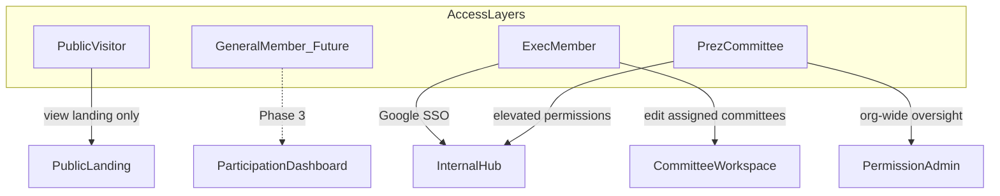
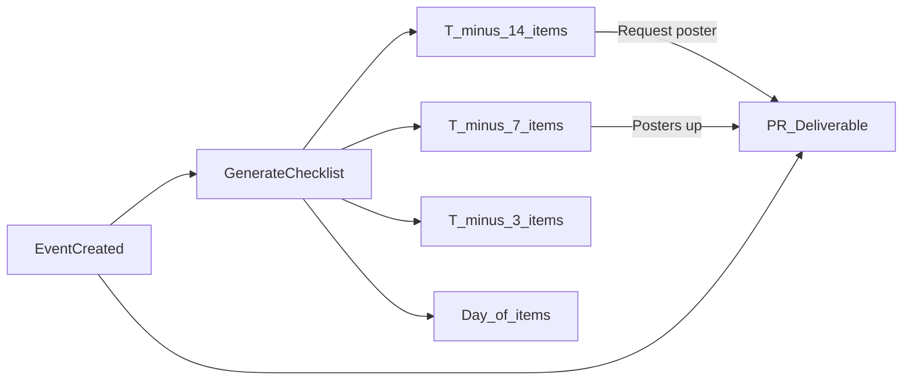
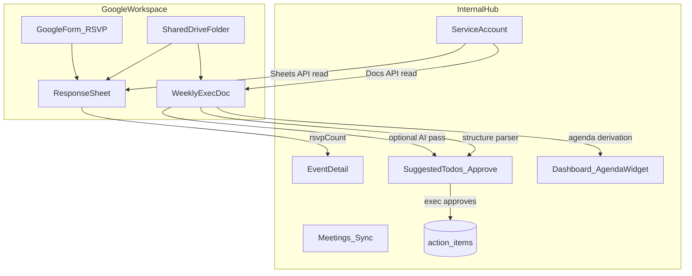
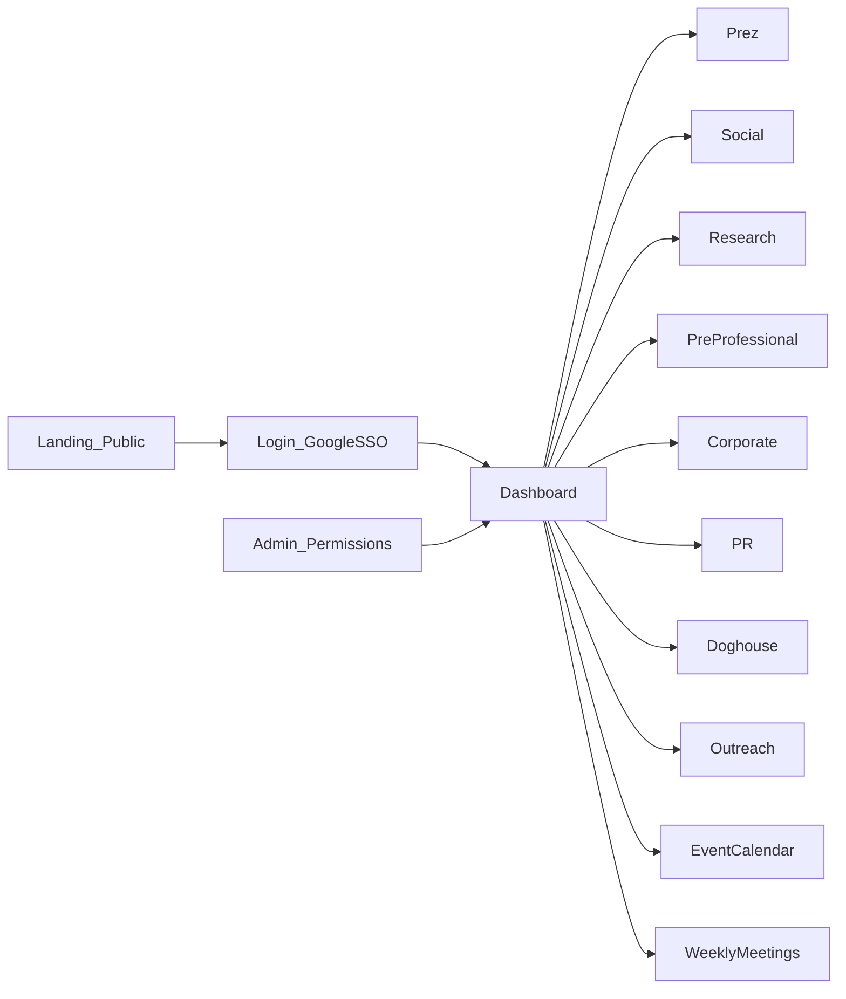
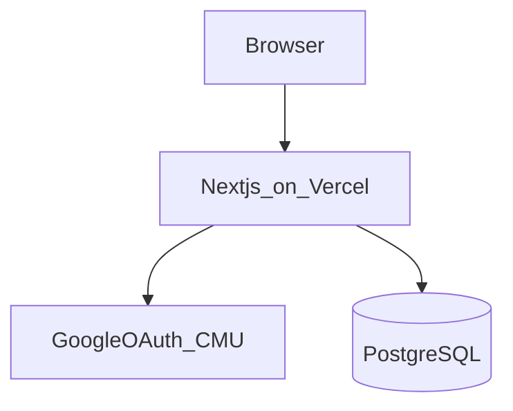

# IEEE CMU Chapter Website — Design Documentation

**Version:** 1.2  
**Organization:** IEEE Student Chapter at Carnegie Mellon University (ECE-focused)  
**Status:** Draft — pending officer review of open items (see [Section 12](#12-open-items))

---

## Table of Contents

1. [Executive Summary](#1-executive-summary)
2. [Goals and Non-Goals](#2-goals-and-non-goals)
3. [Membership Model](#3-membership-model)
4. [User Personas, Permissions, and Admin Panel](#4-user-personas-permissions-and-admin-panel)
5. [Committee Reference](#5-committee-reference)
6. [Feature Specifications](#6-feature-specifications)
7. [Information Architecture and Wireframes](#7-information-architecture-and-wireframes)
8. [Data Model and API Outline](#8-data-model-and-api-outline)
9. [Technical Architecture and Deployment](#9-technical-architecture-and-deployment)
10. [Security and Privacy](#10-security-and-privacy)
11. [UI/UX and Branding](#11-uiux-and-branding)
12. [Open Items](#12-open-items)
13. [Phased Roadmap and Success Metrics](#13-phased-roadmap-and-success-metrics)
14. [Appendix](#14-appendix)

---

## 1. Executive Summary

The IEEE CMU student chapter serves Electrical and Computer Engineering students at Carnegie Mellon University. The organization has grown to **8 committees** (including Prez), each running events and programs on different cadences. Weekly exec board meetings need a single source of truth for committee progress.

This document specifies an **internal operations hub** with a **minimal public landing page**:

- **Public visitors** see org info and how to join — no login required.
- **Exec-board members only** log in via CMU Google SSO to manage committees, events, meeting notes, KPIs, and **per-event planning checklists**.
- **General member accounts** (participation tracking) are explicitly deferred to a future phase.

The system adapts tracking by committee type: **operational** (Prez), **events** (most committees), and **deliverables** (PR — posters and Instagram, not events). Each org event (except Prez recurring meetings) gets an auto-generated **planning checklist** with milestones at T-14, T-7, T-3, and day-of. **Phase 2.5** adds read-only Google Workspace sync: RSVP counts from Forms response Sheets and action-item suggestions from weekly exec Docs (exec approves before commit).

---

## 2. Goals and Non-Goals

### Goals

| Goal | Description |
| ---- | ----------- |
| **Weekly meeting readiness** | Exec board reviews all 8 committees in under 5 minutes from one dashboard |
| **Event cadence visibility** | Surface committees behind the "≥ 1 event per 1–2 months" expectation |
| **Signature tracking** | Track semester flagship items (GBMs, research talks, ice skating, etc.) |
| **PR deliverable tracking** | Ensure every org event has a poster; log Instagram activity |
| **Event planning readiness** | Per-event checklists (T-14 / T-7 / T-3 / day-of) so execs see what's due before each event |
| **Prez operational oversight** | Track exec meetings, Kimmy advisor syncs, finances, committee check-ins |
| **Low maintenance** | Rotating student leadership can operate the site without deep technical knowledge |
| **Flexible permissions** | President manually configures who can edit what across committees |
| **Google Workspace read sync** | Read RSVP counts from Sheets and meeting content from Docs; Google remains source of truth |

### Non-Goals (MVP and Phase 2)

- General member login or participation dashboards
- Public event calendar with internal data
- Sponsor CRM, Slack/Discord integrations, photo galleries
- Mobile native apps
- **Writing back to Google Docs/Sheets** — read-only integration; execs keep editing in Google
- **Replacing Google Docs** as the meeting-notes editor — Docs stay canonical; the app imports and derives todos/agenda

---

## 3. Membership Model

Two distinct layers — do not conflate them.

| Layer | Who | Website access |
| ----- | --- | -------------- |
| **General member** | Anyone in the CMU community (flexible membership — not limited to ECE majors) | Public landing only today; **future (Phase 3):** read-only participation dashboard |
| **Exec member** | Anyone on the exec-board roster, including all committee participants | Full internal hub via CMU Google SSO |

**Key rules:**

- Committee participation = exec membership. Everyone listed on a committee is an exec member.
- A person may appear on **multiple committee rosters** simultaneously.
- Only exec-board roster members can log in. Non-roster `@andrew.cmu.edu` emails are rejected at login.



---

## 4. User Personas, Permissions, and Admin Panel

### Personas

| Persona | Example | Primary need |
| ------- | ------- | ------------ |
| **President / VP** | Prez committee | Org-wide visibility, permission management, weekly meeting prep |
| **Committee exec** | Social chair on Social + PR | Edit own committee(s), log events and meeting notes |
| **Multi-committee exec** | Member on Corporate and Pre-professional | Edit access to both; dashboard shows "My committees" |
| **Advisor** | Kimmy (`@cmu.edu`) | Optional read-only access to Prez meeting notes *(TBD — see Open Items)* |
| **General member** | Any CMU student | Public landing; future participation view |
| **Public visitor** | Prospective member, sponsor | Landing page only |

### Access tiers

| Tier | Who | Access today |
| ---- | --- | ------------ |
| **Public** | Anyone on the internet | Landing page only |
| **Exec member** | Exec-board roster | Dashboard, calendar, meetings, committee pages (read all; edit assigned) |
| **Prez committee** | President + Vice President | Elevated defaults: edit all committees, admin panel |
| **General member** *(future)* | Open IEEE membership | Participation dashboard (read-only) |

### Permission model (manual, Admin-configured)

Rather than a rigid role hierarchy, permissions are **assigned per user by the President (or designated Admin)**. Defaults are suggested; all overrides are manual.

#### Default permission matrix

| Permission | Prez committee (default) | Committee exec (default) |
| ---------- | ------------------------ | ------------------------ |
| View all committees | Yes | Yes (read-only on non-assigned) |
| Edit assigned committee(s) | Yes (all committees) | Yes (own committee(s) only) |
| Add meeting notes | All committees | Assigned committee(s) only |
| Manage events | All committees | Assigned committee(s) only |
| Manage deliverables (PR) | Yes | PR committee only |
| Manage users & permissions | Yes | No |
| View admin panel | Yes | No |
| Edit operational checklist (Prez) | Yes | No |

#### Multi-committee example

A member on both **Social** and **PR** committees receives:

- `committeeEditScopes: ["social", "pr"]`
- Edit access to Social events and PR deliverables
- Read-only view of all other committees
- Dashboard "My committees" section lists both

#### Permission check logic

```
canViewInternal(user):
  return user.isExecMember && user.status == "active"

canEdit(user, committeeSlug):
  if user.permissions.canEditAll → true
  if committeeSlug in user.permissions.committeeEditScopes → true
  else → false

canManageUsers(user):
  return user.permissions.canManageUsers
```

#### Auth flow

1. User clicks "Exec Login" → Google OAuth (restricted to `@andrew.cmu.edu`; optionally `@cmu.edu` for advisors).
2. On callback: if email exists on exec roster with `status: active` → create session, apply permissions.
3. If email not on roster → reject with message: *"Access is limited to IEEE CMU exec board. Contact the President to be added."*
4. President uses Admin panel to add/remove roster entries, assign committees, override permissions.

### Admin panel specification

**Route:** `/admin` (Prez / `canManageUsers` only)

| Section | Actions |
| ------- | ------- |
| **Exec roster** | Add/remove user by email; set active/inactive |
| **Committee assignments** | Assign user to one or more committees (multi-select) |
| **Permission overrides** | Toggles: `canViewAll`, `canEditAll`, `canManageUsers`; edit `committeeEditScopes` |
| **Signature templates** | Edit canonical signature item list per committee |
| **System settings** | Cadence thresholds (45/60 days), semester dates, contact email |

---

## 5. Committee Reference

Each committee gets a dedicated page (`/committees/[slug]`) and a card on the org-wide dashboard. **Prez** is pinned first.

### Tracking types

| Tracking type | Committees | What gets tracked |
| ------------- | ---------- | ----------------- |
| **Operational** | Prez | Recurring meetings, advisor syncs, financial tracking, committee check-ins |
| **Events** | Social, Research, Pre-professional, Corporate, Doghouse, Outreach | Signature and general events on the calendar |
| **Deliverables** | PR | Instagram posts and event posters linked to other committees' events |

### Committee details (officer-confirmed)

| Slug | Name | Tracking | Key responsibilities / signature items |
| ---- | ---- | -------- | -------------------------------------- |
| `prez` | Prez | Operational | Weekly exec board meeting; bi-weekly advisor meeting with Kimmy; financial tracking; committee check-ins |
| `social` | Social | Events | General body meeting (2×/semester); ice skating near Valentine's Day |
| `research` | Research | Events | Research talks (2×/semester) |
| `pre-professional` | Pre-professional | Events | Mentor-mentee matching; course chat; dinner events; destress events |
| `corporate` | Corporate | Events | Company info sessions; coffee chats; resume reviews |
| `pr` | PR | Deliverables | No events — Instagram account; posters per org event |
| `doghouse` | Doghouse | Events | Carnival kickoff planning; Midway exhibition *(confirm with officers)* |
| `outreach` | Outreach | Events | K-12 outreach workshop |

### Cadence expectations

- **Event-based committees** (Social, Research, Pre-professional, Corporate, Doghouse, Outreach): target **≥ 1 event every 1–2 months**.
- **PR:** excluded from event cadence; tracked on poster backlog + Instagram activity.
- **Prez:** tracked on operational KPIs (meetings, finance, check-ins).

### Semester signature checklists

| Committee | Checklist items |
| --------- | --------------- |
| **Social** | GBM 1 of 2; GBM 2 of 2; Ice skating (Valentine's) |
| **Research** | Research talk 1 of 2; Research talk 2 of 2 |
| **Pre-professional** | Mentor matching complete; Course chat; Dinner; Destress event(s) |
| **Corporate** | Info session(s); Coffee chat(s); Resume review(s) — track count per semester |
| **Doghouse** | Carnival kickoff; Midway exhibition |
| **Outreach** | K-12 outreach workshop |

---

## 6. Feature Specifications

### 6.1 Dashboard (`/dashboard`)

Primary view for weekly exec meetings. All 8 committee cards visible on one screen (desktop).

#### Per-committee card (by tracking type)

| Field | Prez (operational) | Events committees | PR (deliverables) |
| ----- | ------------------ | ----------------- | ----------------- |
| Status badge | Green / yellow / red from ops KPIs | Event cadence rule | Poster backlog + IG activity |
| Primary metric | Last exec meeting; next Kimmy meeting; finance status | Days since last event; next event | Posters pending; last IG post |
| Checklist | Weekly exec ✓; Kimmy sync ✓; committee check-ins | Semester signature items | Posters per upcoming event |
| Common | Open action items; last meeting note date | Open action items; last meeting note date | Open action items; last meeting note date |

#### Org-wide widgets

- Events this month (by committee)
- Committees behind event cadence (excludes PR and Prez)
- Signature events this semester — master checklist
- PR deliverable backlog — events missing posters
- **Event planning due** — events in the next 14 days with incomplete T-14 or T-7 checklist items
- **Next week agenda** — derived from latest Google Doc import (see [Section 6.8](#68-google-workspace-integration-read-only)); grouped by committee
- Overdue action items
- Prez ops snapshot — finance status; committees not checked in this month

#### KPI rules

**Event cadence (event-based committees):**

| Status | Condition |
| ------ | --------- |
| On track | Event in last 45 days OR event scheduled within next 30 days |
| At risk | No event in 45–60 days and nothing scheduled |
| Behind | No event in 60+ days and nothing scheduled |

**Prez operational KPIs:**

- Weekly exec meeting logged each week during semester
- Bi-weekly Kimmy advisor meeting on schedule
- Financial tracking updated within last 14 days
- Each committee checked in at least once per month

**PR deliverable KPIs:**

- Every upcoming org event has a poster deliverable with status
- At least 1 Instagram post within last 14 days during active semester

*(Thresholds configurable in Admin.)*

### 6.2 Event calendar (`/calendar`)

| Field | Type | Notes |
| ----- | ---- | ----- |
| `title` | string | Required |
| `committeeId` | FK | Owning committee |
| `startAt` | datetime | Required |
| `endAt` | datetime | Optional |
| `location` | string | Optional |
| `description` | text | Optional |
| `status` | enum | `planned` \| `confirmed` \| `completed` \| `cancelled` |
| `isSignature` | boolean | Flagship event (GBM, ice skating, etc.) |
| `recurrence` | enum | `none` \| `weekly` \| `biweekly` — for Prez recurring meetings |
| `meetingNoteId` | FK | Optional link to recap |
| `signupFormUrl` | string | Headcount sign-up form (Google Form link) |
| `googleSheetId` | string | Response Sheet ID for RSVP sync *(Phase 2.5)* |
| `rsvpCount` | int | Populated manually or via Sheet sync |
| `rsvpLastSyncedAt` | timestamptz | Last successful Sheets read |
| `needsFood` | boolean | Shows food-related checklist items |
| `needsSupplies` | boolean | Shows supplies / Kimmy email checklist item |
| `hasExternalGuests` | boolean | Shows company/faculty guest confirmation item |
| `coHostIds` | uuid[] | Exec co-hosts (≥ 2 required by T-3) |
| `usePlanningChecklist` | boolean | Default `true`; set `false` for Prez recurring meetings |

**Behaviors:**

- Month and list views; filter by committee or "signature only"
- Completed events count toward event cadence KPIs
- When any committee creates an event → auto-create a PR poster deliverable (status: `not_started`, due T-7)
- Cross-committee: PR attaches deliverables to any committee's events
- Event list and calendar link to `/events/[id]` for planning checklist detail
- Prez recurring meetings (`recurrence = weekly` or `biweekly`) set `usePlanningChecklist = false` automatically

### 6.2b Event planning checklist

Officer-confirmed checklist auto-attached to **all org events except Prez recurring meetings** (weekly exec board, bi-weekly Kimmy syncs). One-off Prez events and all event-based committee events receive the checklist.



#### T-14 days (2 weeks before)

| Item | Optional? | System integration |
| ---- | --------- | ------------------- |
| Finalize details of event | No | — |
| Confirm attendance of company or faculty guests | Yes | Shown when `hasExternalGuests = true` |
| Order supplies, if needed — email Kimmy | Yes | Shown when `needsSupplies = true`; link to advisor contact |
| Make room reservation | No | Event `location` field |
| Make sign-up form for headcount | No | Event `signupFormUrl`; note to include in poster and weekly announcements |
| Request poster in #pr-requests | No | Links to auto-created PR deliverable; auto-mark done when deliverable → `in_progress` |
| Request event blurb for next weekly announcement | No | — |

#### T-7 days (1 week before)

| Item | Optional? | System integration |
| ---- | --------- | ------------------- |
| All posters are up (including on social media) | No | PR deliverable status → `done` |
| Order food if needed | Yes | Shown when `needsFood = true` |

#### T-3 days (3 days before)

| Item | Optional? | System integration |
| ---- | --------- | ------------------- |
| Check RSVP count (adjust food quantity / room size if needed) | No | `rsvpCount` from Sheet sync or manual entry |
| Ensure at least 2 other exec board members can be present | No | Event `coHostIds` — validate ≥ 2 assigned |
| Make food pickup arrangements, if needed | Yes | Shown when `needsFood = true` |
| Have slides prepared | Yes | Can mark N/A |

#### Day of event (T-0)

| Item | Optional? | Notes |
| ---- | --------- | ----- |
| Pick up food and/or supplies, if needed | Yes | Shown when `needsFood` or `needsSupplies` |
| Arrive at room 30 minutes prior to set up | No | — |
| Write attendance form link on the board / keep visible | Recommended | `isRecommended = true` in UI |
| Take photos | No | — |
| Clean up the room after event | No | — |
| Congratulate yourself on a job well done! | No | Low priority in dashboard alerts |

#### Checklist behaviors

- **Auto-generation:** On event create when `usePlanningChecklist = true`, copy items from org-wide template (see [Appendix E](#appendix-e-event-planning-checklist-template-master))
- **Due dates:** `dueDate = event.startAt - offsetDays` (14, 7, 3, or 0)
- **Item status:** `pending` \| `done` \| `not_applicable`
- **Conditional items:** Hidden or auto-N/A unless event toggles (`needsFood`, `needsSupplies`, `hasExternalGuests`) are enabled
- **Overdue:** Items with `today > dueDate && status = pending` highlighted on dashboard and event detail page
- **Progress:** Event detail shows `done / applicable items` progress bar per milestone and overall

#### Event detail page (`/events/[id]`)

Primary surface for running through the checklist:

- Event header: title, date, committee, location, status, signature badge
- Event toggles: Needs food · Needs supplies · External guests
- Fields: Sign-up form URL · RSVP count · Co-hosts (exec multi-select)
- Checklist accordion grouped by milestone
- Link to PR deliverable status for poster-related items
- Link back to owning committee page

### 6.3 PR deliverables (no events for PR committee)

PR does not create calendar events. Instead:

**Poster deliverable**

| Field | Type | Notes |
| ----- | ---- | ----- |
| `linkedEventId` | FK | Event from any other committee |
| `designerId` | FK | Optional assignee |
| `status` | enum | `not_started` \| `in_progress` \| `done` |
| `dueDate` | date | Default: T-7 (1 week before event), aligned with "All posters up" checklist item |
| `assetUrl` | string | Link to final poster file |

**PR integration with event planning checklist:**

- Event create → auto-create poster deliverable (`not_started`)
- T-14 item "Request poster in #pr-requests" links to deliverable; marks done when status → `in_progress`
- T-7 item "All posters up" marks done when deliverable status → `done`
- PR committee sees poster backlog on dashboard; event owners see deliverable status on event detail page

**Instagram post log**

| Field | Type | Notes |
| ----- | ---- | ----- |
| `postedAt` | date | Required |
| `captionSummary` | string | Short description |
| `postUrl` | string | Link to post |
| `linkedEventId` | FK | Optional |

### 6.4 Weekly meetings and action items (`/meetings`)

**Sources:** In-app notes (Phase 1) and **Google Docs** (Phase 2.5 — preferred for weekly exec meetings). Google Doc remains the canonical editor; the app imports read-only content.

**Meeting note fields:**

| Field | Type | Notes |
| ----- | ---- | ----- |
| `meetingDate` | date | Required; parsed from Doc header when possible (e.g. `4/18`) |
| `committeeId` | FK | Primary committee; `prez` for org-wide weekly exec notes |
| `authorId` | FK | Who triggered sync or wrote in-app note |
| `attendeeIds` | FK[] | Multi-select from exec roster |
| `summary` | rich text | Imported section summaries or manual entry |
| `googleDocId` | string | Linked weekly exec Doc *(Phase 2.5)* |
| `googleDocUrl` | string | Open-in-Docs link |
| `lastSyncedAt` | timestamptz | Last successful Doc import |
| `importedPlainText` | text | Cached Doc body for search |
| `actionItems` | embedded[] | Created inline or **approved from import suggestions** |

**Action item fields:**

| Field | Type | Notes |
| ----- | ---- | ----- |
| `description` | string | Required |
| `ownerId` | FK | Assignee; matched from roster via heuristic name lookup |
| `dueDate` | date | Optional; parsed when present in Doc text |
| `status` | enum | `open` \| `done` |
| `committeeId` | FK | For dashboard filtering |
| `source` | enum | `manual` \| `google_doc` — how the item was created |
| `sourceImportId` | FK | Link to import batch for deduplication |

**Workflow:**

- Exec with edit permission adds in-app notes or links a Google Doc and clicks **Sync**
- Sync produces **suggested** action items and agenda lines — **exec must approve** before rows are written to `action_items` (see Section 6.8)
- Prez committee can sync org-wide weekly Doc; committee leads see their section's suggestions
- Approved action items surface on committee page and dashboard
- Done items archived, searchable (including over imported plain text cache)

### 6.5 Committee pages (`/committees/[slug]`)

| Section | Shown for |
| ------- | --------- |
| Overview | All — mission, roster, tracking type, signature items |
| Goals & KPIs | All — type-specific (see Section 5) |
| Events | All except PR — each event links to `/events/[id]` planning checklist |
| Deliverables | PR only |
| Operational checklist | Prez only — finance status, check-in matrix, advisor schedule |
| Meeting notes | All |
| Action items | All |

**Prez operational checklist fields:**

| Item | Type | Notes |
| ---- | ---- | ----- |
| Finance last updated | date | Manual update by Prez |
| Finance notes | text | Budget summary, expenses |
| Committee check-ins | matrix | Per committee: last check-in date, notes |
| Next Kimmy meeting | date | From bi-weekly recurring event |

### 6.6 Goals (custom, exec-managed)

| Field | Type | Notes |
| ----- | ---- | ----- |
| `title` | string | e.g., "Complete mentor matching by Week 4" |
| `targetMetric` | string | Optional quantifiable target |
| `deadline` | date | Optional |
| `status` | enum | `not_started` \| `in_progress` \| `completed` |
| `notes` | text | Optional |

### 6.7 Public landing (`/`)

Single page, no internal data exposed.

| Section | Content |
| ------- | ------- |
| Hero | IEEE CMU branding, one-line mission *(placeholder)* |
| About | ECE-focused student org; flexible membership — anyone can join |
| Committees | Names only as tags (8 committees) |
| Join CTA | Contact email *(placeholder)* or link to interest form |
| Links | [ieee.org](https://www.ieee.org) |
| Footer | IEEE logo usage note; CMU affiliation disclaimer |
| Exec login | Small "Exec Login" link → Google SSO (not prominent) |

### 6.8 Google Workspace integration (read-only)

The chapter uses a **Google service account** with access to a shared org Drive folder (Forms response Sheets, weekly exec Docs, planning calendars). The app **reads only** — no writes to Google. Exec login (OAuth) remains separate from service-account API access.



#### Design principles

| Principle | Detail |
| --------- | ------ |
| **Google is source of truth** | Forms, Sheets, and Docs stay where execs already work |
| **No strict Doc template required** | Parser uses Doc structure (headings, bullet nesting) + heuristics; optional AI for messy prose |
| **Human approval gate** | Nothing writes to `action_items` without exec confirmation |
| **Service account** | Org-owned credentials; shared folder granted to service account email |
| **Read-only scopes** | `spreadsheets.readonly`, `documents.readonly`, `drive.readonly` |

#### 6.8.1 Google Sheets — RSVP sync (highest ROI)

**Purpose:** Auto-fill `events.rsvpCount` for the T-3 checklist item “Check RSVP count.”

**Setup per event:**

1. Event has `signupFormUrl` (Google Form).
2. Exec links `googleSheetId` (response Sheet URL or ID) — same Sheet the Form writes to.
3. Service account must have **Viewer** access to that Sheet (via shared folder or direct share).

**Sync behavior:**

| Trigger | Action |
| ------- | ------ |
| Manual | “Sync RSVP” button on `/events/[id]` |
| Scheduled *(later)* | Cron hourly + optional pre–weekly-meeting job |

**Read logic:**

- Call Sheets API `spreadsheets.values.get` on response tab.
- Count rows with timestamp filled (exclude header row) → `rsvpCount`.
- Set `rsvpLastSyncedAt`; show “Last synced …” on event detail.
- If count changed, surface on dashboard event-planning widget.

**Error handling:** Permission denied, missing Sheet, or Form structure change → show inline error; fall back to manual count.

#### 6.8.2 Google Docs — meeting import + suggested action items

**Purpose:** Import weekly exec meeting notes from the org’s existing Doc format (nested bullets under committee names, informal updates, embedded Sheet links) without imposing a rigid template.

**Setup:**

- `/meetings` — link `googleDocUrl` for the current week’s exec Doc (or select from known folder).
- **Sync** button (Prez / `canEdit(prez)` or designated secretary).

**Import pipeline:**

1. **Fetch** — Docs API returns document structure (paragraphs, bullet nesting, links).
2. **Parse structure** — Identify sections:
   - Top-level blocks: “Exec Updates”, “Event Planning Calendar”, “Committee Updates”
   - Nested bullets under committee names → map to committee slug via fuzzy match (`Prez`, `Pre-professional`, `Corporate`, etc.)
   - Extract embedded URLs (Sheets, Forms) for optional linking
   - Parse meeting date from Doc header when present (e.g. `4/18`)
3. **Heuristic extraction** — Flag likely action items per committee section:
   - Lines prefixed with `NEW:` → org-wide or Prez-scoped suggestions
   - Lines containing assignee names (match exec roster), dates, imperatives (“need to”, “will”, “update”, “create”)
   - Lines marked `Done!` → suggest closing matching open `action_items` *(v2)*
4. **Optional AI pass** — If heuristics yield low confidence, send each committee section text to a model with JSON schema output (`description`, `ownerGuess`, `dueDateGuess`, `committee`). Disabled by default; enable via Admin setting. Weekly volume is small (~1 Doc/week).
5. **Store import batch** — `doc_imports` record with raw text, parsed sections, suggestions (not yet committed).
6. **Review UI** — `/meetings/[id]/review` shows checkboxes per suggested action item; exec edits text/owner/date; **Approve selected** writes to `action_items` with `source: google_doc`.
7. **Cache** — Save `importedPlainText` on `meeting_notes` for Phase 2 search.

**No strict format required.** Existing style (nested bullets, free-form updates, logistics blocks) is supported. Only soft convention: committee names as nested section headers under “Committee Updates.”

#### 6.8.3 Next-week agenda (dashboard widget)

**Purpose:** Help Prez run weekly meetings without re-reading the full Doc.

**Derived from latest successful Doc import:**

| Source in Doc | Agenda line |
| ------------- | ----------- |
| Approved open action items | Carry forward with owner |
| Suggested items not yet approved | “Pending approval: …” |
| Future-dated events mentioned in committee sections | e.g. “Pre-prof: mentor event Apr 22” |
| `NEW:` exec updates | “Roll out: …” |
| Heuristic “planning / next semester / need to” lines | Soft agenda candidates |

**Dashboard widget:** “Next week agenda (from Doc 4/18)” — bullet list grouped by committee; link to open Google Doc.

Stored in `agenda_items` table (see Section 8); replaced on each import (not merged with old agenda).

#### 6.8.4 Scheduled sync (later — Phase 2.5b)

| Job | Schedule | Scope |
| --- | -------- | ----- |
| RSVP sync | Every hour | All upcoming events with `googleSheetId` in next 30 days |
| Doc import | Manual only initially | — |
| Doc import (automated) | Optional: hourly + 1× before weekly exec meeting | Latest linked weekly Doc; **still requires approval** for action items; agenda auto-refreshed |

Cron runs server-side (Vercel Cron, GitHub Action, or similar) using service account credentials.

#### 6.8.5 Service account configuration

| Variable | Purpose |
| -------- | ------- |
| `GOOGLE_SERVICE_ACCOUNT_EMAIL` | Service account client email |
| `GOOGLE_SERVICE_ACCOUNT_PRIVATE_KEY` | PEM private key (JSON key file, escaped for env) |
| `GOOGLE_DRIVE_FOLDER_ID` | Optional root folder for discovering weekly Docs |

**Folder setup (one-time):**

1. Create or use existing IEEE CMU shared Drive folder.
2. Share folder with service account email as **Viewer** (read-only).
3. Store Forms response Sheets and weekly exec Docs in that folder.

Exec **login** OAuth is unchanged — service account handles background API reads only.

---

## 7. Information Architecture and Wireframes

### Site map

```
/                          Public landing
/login                     Google SSO redirect
/dashboard                 Org-wide status board
/calendar                  Event calendar
/events/[id]               Event detail + planning checklist
/meetings                  Meeting note index
/meetings/[id]             Single meeting note
/meetings/[id]/review      Approve suggested action items from Doc import [Phase 2.5]
/committees/[slug]         Committee workspace (8 slugs)
/admin                     Roster, permissions, settings
/api/sync/rsvp             [Phase 2.5] RSVP sync endpoints
/api/sync/docs             [Phase 2.5] Doc import endpoints
/my-participation          [Phase 3 — general members]
```



Detailed ASCII wireframes are in [Appendix A](#appendix-a-wireframes).

---

## 8. Data Model and API Outline

### Entity-relationship diagram

```mermaid
erDiagram
  User ||--o{ CommitteeMembership : has
  User ||--o| UserPermission : has
  Committee ||--o{ CommitteeMembership : has
  Committee ||--o{ SignatureEventTemplate : defines
  Committee ||--o{ Event : hosts
  Committee ||--o{ Deliverable : produces
  Event ||--o| Deliverable : posterFor
  Event ||--o{ EventChecklistItem : has
  EventPlanningTemplate ||--o{ EventChecklistItem : defines
  Committee ||--o{ Goal : tracks
  Committee ||--o{ MeetingNote : logs
  Committee ||--o{ CommitteeCheckIn : tracks
  MeetingNote ||--o{ ActionItem : contains
  MeetingNote ||--o{ DocImport : imports
  DocImport ||--o{ SuggestedActionItem : proposes
  DocImport ||--o{ AgendaItem : generates
  User ||--o{ ActionItem : owns
  User ||--o{ MeetingNote : authors

  User {
    uuid id PK
    string email UK
    string name
    boolean isExecMember
    enum status
    timestamp createdAt
    timestamp updatedAt
  }

  UserPermission {
    uuid id PK
    uuid userId FK UK
    boolean canViewAll
    boolean canEditAll
    boolean canManageUsers
    json committeeEditScopes
  }

  Committee {
    uuid id PK
    string slug UK
    string name
    text description
    enum trackingType
    int sortOrder
  }

  CommitteeMembership {
    uuid userId FK
    uuid committeeId FK
    string roleLabel
  }

  SignatureEventTemplate {
    uuid id PK
    uuid committeeId FK
    string name
    string typicalTiming
    int sortOrder
  }

  Event {
    uuid id PK
    uuid committeeId FK
    timestamp startAt
    timestamp endAt
    string title
    string location
    text description
    boolean isSignature
    enum recurrence
    enum status
    uuid meetingNoteId FK
    string signupFormUrl
    string googleSheetId
    int rsvpCount
    timestamp rsvpLastSyncedAt
    boolean needsFood
    boolean needsSupplies
    boolean hasExternalGuests
    json coHostIds
    boolean usePlanningChecklist
    timestamp deletedAt
  }

  EventPlanningTemplate {
    uuid id PK
    int offsetDays
    string title
    int sortOrder
    boolean isOptional
    boolean isRecommended
    enum condition
  }

  EventChecklistItem {
    uuid id PK
    uuid eventId FK
    int offsetDays
    string title
    int sortOrder
    boolean isOptional
    boolean isRecommended
    enum condition
    enum status
    date dueDate
    uuid linkedDeliverableId FK
    timestamp completedAt
    uuid completedBy FK
  }

  Deliverable {
    uuid id PK
    uuid committeeId FK
    uuid linkedEventId FK
    uuid designerId FK
    enum type
    enum status
    date dueDate
    string assetUrl
    string captionSummary
    string postUrl
    date postedAt
  }

  MeetingNote {
    uuid id PK
    uuid committeeId FK
    uuid authorId FK
    date meetingDate
    text summary
    json attendeeIds
    string googleDocId
    string googleDocUrl
    timestamp lastSyncedAt
    text importedPlainText
    timestamp createdAt
  }

  DocImport {
    uuid id PK
    uuid meetingNoteId FK
    uuid triggeredBy FK
    timestamp importedAt
    text rawPlainText
    json parsedSections
    enum status
  }

  SuggestedActionItem {
    uuid id PK
    uuid docImportId FK
    uuid committeeId FK
    uuid ownerId FK
    string description
    date dueDate
    enum confidence
    enum approvalStatus
  }

  AgendaItem {
    uuid id PK
    uuid docImportId FK
    uuid committeeId FK
    string text
    int sortOrder
    date forMeetingDate
  }

  ActionItem {
    uuid id PK
    uuid meetingNoteId FK
    uuid committeeId FK
    uuid ownerId FK
    uuid sourceImportId FK
    string description
    date dueDate
    enum status
    enum source
    timestamp completedAt
  }

  Goal {
    uuid id PK
    uuid committeeId FK
    string title
    string targetMetric
    date deadline
    enum status
    text notes
  }

  CommitteeCheckIn {
    uuid id PK
    uuid prezCommitteeId FK
    uuid targetCommitteeId FK
    date checkedInAt
    text notes
    uuid checkedInBy FK
  }

  PrezFinanceSnapshot {
    uuid id PK
    date lastUpdated
    text notes
    uuid updatedBy FK
  }
```

### Field-level schema (PostgreSQL)

#### `users`

| Column | Type | Constraints |
| ------ | ---- | ----------- |
| `id` | `uuid` | PK, default `gen_random_uuid()` |
| `email` | `varchar(255)` | UNIQUE, NOT NULL |
| `name` | `varchar(255)` | NOT NULL |
| `is_exec_member` | `boolean` | DEFAULT true |
| `status` | `varchar(20)` | `active` \| `inactive` |
| `created_at` | `timestamptz` | DEFAULT now() |
| `updated_at` | `timestamptz` | DEFAULT now() |

#### `user_permissions`

| Column | Type | Constraints |
| ------ | ---- | ----------- |
| `id` | `uuid` | PK |
| `user_id` | `uuid` | FK → users, UNIQUE |
| `can_view_all` | `boolean` | DEFAULT true |
| `can_edit_all` | `boolean` | DEFAULT false |
| `can_manage_users` | `boolean` | DEFAULT false |
| `committee_edit_scopes` | `jsonb` | Array of committee slugs |

#### `committees`

| Column | Type | Constraints |
| ------ | ---- | ----------- |
| `id` | `uuid` | PK |
| `slug` | `varchar(50)` | UNIQUE, NOT NULL |
| `name` | `varchar(100)` | NOT NULL |
| `description` | `text` | |
| `tracking_type` | `varchar(20)` | `operational` \| `events` \| `deliverables` |
| `sort_order` | `int` | DEFAULT 0 |

#### `committee_memberships`

| Column | Type | Constraints |
| ------ | ---- | ----------- |
| `user_id` | `uuid` | FK → users, PK composite |
| `committee_id` | `uuid` | FK → committees, PK composite |
| `role_label` | `varchar(100)` | e.g., "Chair", "Member" |

#### `events`

| Column | Type | Constraints |
| ------ | ---- | ----------- |
| `id` | `uuid` | PK |
| `committee_id` | `uuid` | FK → committees |
| `title` | `varchar(255)` | NOT NULL |
| `start_at` | `timestamptz` | NOT NULL |
| `end_at` | `timestamptz` | |
| `location` | `varchar(255)` | |
| `description` | `text` | |
| `is_signature` | `boolean` | DEFAULT false |
| `recurrence` | `varchar(20)` | `none` \| `weekly` \| `biweekly` |
| `status` | `varchar(20)` | NOT NULL |
| `meeting_note_id` | `uuid` | FK → meeting_notes, nullable |
| `signup_form_url` | `text` | |
| `google_sheet_id` | `varchar(255)` | Response Sheet ID for RSVP sync *(Phase 2.5)* |
| `rsvp_count` | `int` | Manual or synced from Sheet |
| `rsvp_last_synced_at` | `timestamptz` | Last successful Sheets sync |
| `needs_food` | `boolean` | DEFAULT false |
| `needs_supplies` | `boolean` | DEFAULT false |
| `has_external_guests` | `boolean` | DEFAULT false |
| `co_host_ids` | `jsonb` | Array of user UUIDs |
| `use_planning_checklist` | `boolean` | DEFAULT true |
| `deleted_at` | `timestamptz` | Soft delete |

#### `event_planning_templates`

Org-wide default checklist template. Admin-editable in Phase 2; seeded at deploy.

| Column | Type | Constraints |
| ------ | ---- | ----------- |
| `id` | `uuid` | PK |
| `offset_days` | `int` | 14, 7, 3, or 0 |
| `title` | `text` | NOT NULL |
| `sort_order` | `int` | Order within milestone |
| `is_optional` | `boolean` | DEFAULT false |
| `is_recommended` | `boolean` | DEFAULT false |
| `condition` | `varchar(30)` | `always` \| `needs_food` \| `needs_supplies` \| `has_external_guests` \| `needs_food_or_supplies` |

#### `event_checklist_items`

Per-event checklist instances copied from template on event create.

| Column | Type | Constraints |
| ------ | ---- | ----------- |
| `id` | `uuid` | PK |
| `event_id` | `uuid` | FK → events, NOT NULL |
| `offset_days` | `int` | 14, 7, 3, or 0 |
| `title` | `text` | NOT NULL |
| `sort_order` | `int` | |
| `is_optional` | `boolean` | DEFAULT false |
| `is_recommended` | `boolean` | DEFAULT false |
| `condition` | `varchar(30)` | `always` \| `needs_food` \| `needs_supplies` \| `has_external_guests` \| `needs_food_or_supplies` |
| `status` | `varchar(20)` | `pending` \| `done` \| `not_applicable` |
| `due_date` | `date` | Computed from event.start_at |
| `linked_deliverable_id` | `uuid` | FK → deliverables, nullable |
| `completed_at` | `timestamptz` | |
| `completed_by` | `uuid` | FK → users, nullable |

**Key enums (checklist):**

- `EventChecklistItem.status`: `pending` \| `done` \| `not_applicable`
- `EventChecklistItem.condition`: `always` \| `needs_food` \| `needs_supplies` \| `has_external_guests` \| `needs_food_or_supplies`

#### `deliverables`

| Column | Type | Constraints |
| ------ | ---- | ----------- |
| `id` | `uuid` | PK |
| `committee_id` | `uuid` | FK → committees (PR) |
| `linked_event_id` | `uuid` | FK → events, nullable |
| `designer_id` | `uuid` | FK → users, nullable |
| `type` | `varchar(20)` | `poster` \| `instagram_post` |
| `status` | `varchar(20)` | `not_started` \| `in_progress` \| `done` |
| `due_date` | `date` | |
| `asset_url` | `text` | Poster file link |
| `caption_summary` | `text` | IG only |
| `post_url` | `text` | IG only |
| `posted_at` | `date` | IG only |

#### `meeting_notes`

| Column | Type | Constraints |
| ------ | ---- | ----------- |
| `id` | `uuid` | PK |
| `committee_id` | `uuid` | FK → committees |
| `author_id` | `uuid` | FK → users |
| `meeting_date` | `date` | NOT NULL |
| `summary` | `text` | |
| `attendee_ids` | `jsonb` | Array of user UUIDs |
| `google_doc_id` | `varchar(255)` | Linked weekly exec Doc *(Phase 2.5)* |
| `google_doc_url` | `text` | Open-in-Docs link |
| `last_synced_at` | `timestamptz` | Last successful Doc import |
| `imported_plain_text` | `text` | Cached Doc body for search |
| `created_at` | `timestamptz` | DEFAULT now() |

#### `doc_imports`

Batch record for each Google Doc sync; holds parsed structure before exec approval.

| Column | Type | Constraints |
| ------ | ---- | ----------- |
| `id` | `uuid` | PK |
| `meeting_note_id` | `uuid` | FK → meeting_notes, NOT NULL |
| `triggered_by` | `uuid` | FK → users |
| `imported_at` | `timestamptz` | DEFAULT now() |
| `raw_plain_text` | `text` | Full Doc text snapshot |
| `parsed_sections` | `jsonb` | Committee-keyed section blobs from parser |
| `status` | `varchar(20)` | `pending_review` \| `partially_approved` \| `approved` \| `failed` |

#### `suggested_action_items`

Proposed action items from Doc import; not visible as real todos until approved.

| Column | Type | Constraints |
| ------ | ---- | ----------- |
| `id` | `uuid` | PK |
| `doc_import_id` | `uuid` | FK → doc_imports, NOT NULL |
| `committee_id` | `uuid` | FK → committees |
| `owner_id` | `uuid` | FK → users, nullable (heuristic guess) |
| `description` | `text` | NOT NULL |
| `due_date` | `date` | Nullable |
| `confidence` | `varchar(10)` | `high` \| `medium` \| `low` |
| `approval_status` | `varchar(20)` | `pending` \| `approved` \| `rejected` |

#### `agenda_items`

Next-week agenda lines derived from latest Doc import; replaced on each sync.

| Column | Type | Constraints |
| ------ | ---- | ----------- |
| `id` | `uuid` | PK |
| `doc_import_id` | `uuid` | FK → doc_imports, NOT NULL |
| `committee_id` | `uuid` | FK → committees, nullable (org-wide lines) |
| `text` | `text` | NOT NULL |
| `sort_order` | `int` | Display order within committee group |
| `for_meeting_date` | `date` | Target exec meeting date |

#### `action_items`

| Column | Type | Constraints |
| ------ | ---- | ----------- |
| `id` | `uuid` | PK |
| `meeting_note_id` | `uuid` | FK → meeting_notes |
| `committee_id` | `uuid` | FK → committees |
| `owner_id` | `uuid` | FK → users |
| `description` | `text` | NOT NULL |
| `due_date` | `date` | |
| `status` | `varchar(10)` | `open` \| `done` |
| `source` | `varchar(20)` | `manual` \| `google_doc` — DEFAULT `manual` |
| `source_import_id` | `uuid` | FK → doc_imports, nullable |
| `completed_at` | `timestamptz` | |

#### `goals`

| Column | Type | Constraints |
| ------ | ---- | ----------- |
| `id` | `uuid` | PK |
| `committee_id` | `uuid` | FK → committees |
| `title` | `varchar(255)` | NOT NULL |
| `target_metric` | `varchar(255)` | |
| `deadline` | `date` | |
| `status` | `varchar(20)` | NOT NULL |
| `notes` | `text` | |

#### `committee_check_ins`

| Column | Type | Constraints |
| ------ | ---- | ----------- |
| `id` | `uuid` | PK |
| `target_committee_id` | `uuid` | FK → committees |
| `checked_in_at` | `date` | NOT NULL |
| `notes` | `text` | |
| `checked_in_by` | `uuid` | FK → users |

#### `prez_finance_snapshots`

| Column | Type | Constraints |
| ------ | ---- | ----------- |
| `id` | `uuid` | PK |
| `last_updated` | `date` | NOT NULL |
| `notes` | `text` | |
| `updated_by` | `uuid` | FK → users |

### Seed data (committees)

| slug | name | tracking_type | sort_order |
| ---- | ---- | ------------- | ---------- |
| `prez` | Prez | operational | 0 |
| `social` | Social | events | 1 |
| `research` | Research | events | 2 |
| `pre-professional` | Pre-professional | events | 3 |
| `corporate` | Corporate | events | 4 |
| `pr` | PR | deliverables | 5 |
| `doghouse` | Doghouse | events | 6 |
| `outreach` | Outreach | events | 7 |

### API route outline

All `/api/*` routes except public landing data require authenticated exec session.

#### Auth

| Method | Route | Description |
| ------ | ----- | ----------- |
| GET | `/api/auth/signin` | Google OAuth redirect |
| GET | `/api/auth/callback/google` | OAuth callback; roster gate |
| POST | `/api/auth/signout` | End session |
| GET | `/api/auth/session` | Current user + permissions |

#### Dashboard

| Method | Route | Description |
| ------ | ----- | ----------- |
| GET | `/api/dashboard` | Org-wide summary: committee cards, widgets, KPIs, `eventsWithOverdueChecklist`, `nextWeekAgenda` |

#### Committees

| Method | Route | Auth | Description |
| ------ | ----- | ---- | ----------- |
| GET | `/api/committees` | exec | List all committees |
| GET | `/api/committees/[slug]` | exec | Committee detail + KPIs |
| PATCH | `/api/committees/[slug]` | canEdit | Update description (admin) |

#### Events

| Method | Route | Auth | Description |
| ------ | ----- | ---- | ----------- |
| GET | `/api/events` | exec | List; query: `committee`, `status`, `signature`, `from`, `to` |
| POST | `/api/events` | canEdit(committee) | Create; triggers PR poster deliverable + checklist if `usePlanningChecklist` |
| GET | `/api/events/[id]` | exec | Single event with checklist summary |
| PATCH | `/api/events/[id]` | canEdit(committee) | Update event fields, toggles, signupFormUrl, googleSheetId, rsvpCount, coHostIds |
| DELETE | `/api/events/[id]` | canEdit(committee) | Soft delete |

#### Event planning checklist

| Method | Route | Auth | Description |
| ------ | ----- | ---- | ----------- |
| GET | `/api/events/[id]/checklist` | exec | List items grouped by milestone (T-14, T-7, T-3, T-0) |
| PATCH | `/api/events/[id]/checklist/[itemId]` | canEdit(committee) | Update item status (`done` / `not_applicable`); records `completedBy` |

#### Deliverables

| Method | Route | Auth | Description |
| ------ | ----- | ---- | ----------- |
| GET | `/api/deliverables` | exec | List; query: `type`, `status`, `eventId` |
| POST | `/api/deliverables` | canEdit(pr) | Create IG post log |
| PATCH | `/api/deliverables/[id]` | canEdit(pr) | Update poster/IG status; syncs linked checklist items (T-14/T-7 poster tasks) |

#### Meeting notes

| Method | Route | Auth | Description |
| ------ | ----- | ---- | ----------- |
| GET | `/api/meetings` | exec | List; query: `committee`, `from`, `to` |
| POST | `/api/meetings` | canEdit(committee) | Create with inline action items |
| GET | `/api/meetings/[id]` | exec | Single note + action items |
| PATCH | `/api/meetings/[id]` | canEdit(committee) | Update |

#### Google sync *(Phase 2.5)*

| Method | Route | Auth | Description |
| ------ | ----- | ---- | ----------- |
| POST | `/api/sync/rsvp/[eventId]` | canEdit(committee) | Fetch Sheet rows → update `rsvpCount`, `rsvpLastSyncedAt` |
| POST | `/api/sync/rsvp/bulk` | canEditAll or cron secret | Sync all upcoming events with `googleSheetId` (scheduled job) |
| POST | `/api/sync/docs/[meetingId]` | canEdit(prez) | Import linked Google Doc → create `doc_imports`, suggestions, agenda |
| GET | `/api/sync/docs/[meetingId]/suggestions` | exec | List pending `suggested_action_items` for review UI |
| POST | `/api/sync/docs/[meetingId]/approve` | canEdit(prez) | Approve selected suggestions → write to `action_items` |
| GET | `/api/agenda` | exec | Next-week agenda widget data (from latest import) |

#### Action items

| Method | Route | Auth | Description |
| ------ | ----- | ---- | ----------- |
| GET | `/api/action-items` | exec | List; query: `committee`, `status`, `owner` |
| PATCH | `/api/action-items/[id]` | canEdit(committee) | Update status, reassign |

#### Goals

| Method | Route | Auth | Description |
| ------ | ----- | ---- | ----------- |
| GET | `/api/goals` | exec | List by committee |
| POST | `/api/goals` | canEdit(committee) | Create |
| PATCH | `/api/goals/[id]` | canEdit(committee) | Update |

#### Prez operational

| Method | Route | Auth | Description |
| ------ | ----- | ---- | ----------- |
| GET | `/api/prez/check-ins` | exec | Check-in matrix |
| POST | `/api/prez/check-ins` | canEdit(prez) | Log check-in |
| GET | `/api/prez/finance` | exec | Latest finance snapshot |
| PUT | `/api/prez/finance` | canEdit(prez) | Update finance snapshot |

#### Admin

| Method | Route | Auth | Description |
| ------ | ----- | ---- | ----------- |
| GET | `/api/admin/users` | canManageUsers | Exec roster |
| POST | `/api/admin/users` | canManageUsers | Add user to roster |
| PATCH | `/api/admin/users/[id]` | canManageUsers | Update status, committees, permissions |
| DELETE | `/api/admin/users/[id]` | canManageUsers | Deactivate |
| GET | `/api/admin/settings` | canManageUsers | System settings |
| PATCH | `/api/admin/settings` | canManageUsers | Update thresholds, semester dates |

#### Public

| Method | Route | Auth | Description |
| ------ | ----- | ---- | ----------- |
| GET | `/api/public/landing` | none | Mission, committee names, contact — no internal data |

---

## 9. Technical Architecture and Deployment

### Stack

| Layer | Choice | Rationale |
| ----- | ------ | --------- |
| Frontend | Next.js 14+ (App Router) + TypeScript | SSR for landing; client interactivity for dashboard |
| UI | Tailwind CSS + shadcn/ui | Consistent, accessible components |
| Auth | Auth.js (NextAuth) + Google provider | CMU domain restriction; session cookies |
| Database | PostgreSQL (Neon or Supabase free tier) | Relational fit |
| ORM | Drizzle | Lightweight, type-safe, good migration story |
| Hosting | Vercel | Free tier, zero DevOps for student team |
| Email (Phase 2) | Resend | Overdue action item digests |



### Environment variables

| Variable | Purpose |
| -------- | ------- |
| `GOOGLE_CLIENT_ID` | OAuth client |
| `GOOGLE_CLIENT_SECRET` | OAuth secret |
| `AUTH_SECRET` | Session encryption |
| `DATABASE_URL` | PostgreSQL connection |
| `ALLOWED_EMAIL_DOMAINS` | `andrew.cmu.edu,cmu.edu` |
| `NEXT_PUBLIC_CONTACT_EMAIL` | Landing page CTA |
| `GOOGLE_SERVICE_ACCOUNT_EMAIL` | Service account client email *(Phase 2.5)* |
| `GOOGLE_SERVICE_ACCOUNT_PRIVATE_KEY` | PEM private key from JSON key file *(Phase 2.5)* |
| `GOOGLE_DRIVE_FOLDER_ID` | Optional shared folder for Doc discovery *(Phase 2.5)* |
| `CRON_SECRET` | Bearer token for scheduled sync endpoints *(Phase 2.5b)* |
| `ENABLE_DOC_AI_EXTRACTION` | `true` to enable optional AI pass on Doc import *(Phase 2.5)* |

### Deployment flow

1. Connect GitHub repo to Vercel
2. Provision Neon/Supabase PostgreSQL; run Drizzle migrations
3. Configure Google OAuth consent screen (CMU org)
4. Seed committees and signature templates
5. President adds initial exec roster via Admin panel or seed script

### Project structure (recommended)

```
/
├── app/
│   ├── (public)/
│   │   └── page.tsx              # Landing
│   ├── (internal)/
│   │   ├── dashboard/
│   │   ├── calendar/
│   │   ├── events/[id]/
│   │   ├── meetings/
│   │   ├── committees/[slug]/
│   │   └── admin/
│   └── api/
├── components/
├── lib/
│   ├── auth.ts
│   ├── permissions.ts
│   ├── google/                   # Phase 2.5: service account client
│   │   ├── sheets.ts             # RSVP sync
│   │   ├── docs.ts               # Doc fetch + structure parse
│   │   └── parse-heuristics.ts   # Action item + agenda extraction
│   └── db/
├── drizzle/
│   └── schema.ts
└── docs/
    └── DESIGN.md
```

---

## 10. Security and Privacy

| Concern | Mitigation |
| ------- | ---------- |
| Unauthorized access | Roster gate at login; middleware on all internal routes |
| Permission bypass | Server-side `canEdit()` on every mutation; never trust client |
| Data exposure on landing | Public API returns names only; no events, notes, or rosters |
| Session hijacking | HTTP-only secure cookies; Auth.js defaults |
| Advisor access | Optional `@cmu.edu` allowlist with read-only scope *(TBD)* |
| Soft delete | Events and notes use `deleted_at`; no hard delete in MVP |
| Service account key | Store in env only; never commit JSON key file; rotate if leaked |
| Google read scope | Service account limited to Viewer on shared folder; no write scopes |
| Import approval gate | Doc sync never auto-writes `action_items`; exec must approve |
| Audit trail | Phase 2: log permission changes and admin actions |

### Route protection

| Route pattern | Requirement |
| ------------- | ----------- |
| `/`, `/api/public/*` | Public |
| `/dashboard`, `/calendar`, `/events/*`, `/meetings`, `/committees/*` | Active exec session |
| `/admin`, `/api/admin/*` | `canManageUsers` |
| All write APIs | `canEdit(committee)` for relevant committee |

---

## 11. UI/UX and Branding

### Visual identity

| Element | Value |
| ------- | ----- |
| Primary color | IEEE blue `#00629B` |
| Accent color | CMU red `#C41230` (sparingly — badges, CTAs) |
| Typography | System sans-serif stack; clean and readable |
| Tone | Professional engineering org |

### Status badges

| Badge | Color | Meaning |
| ----- | ----- | ------- |
| On track | Green | Meeting KPIs |
| At risk | Yellow | Approaching threshold |
| Behind | Red | Needs attention |
| Signature | Blue outline | Flagship event |

### Layout

- **Desktop-first** dashboard; responsive down to mobile
- Top nav: Dashboard | Calendar | Meetings | Committees ▾ | Admin
- Prez committee card pinned first in grid
- Light mode default (projector-friendly for weekly meetings)

### Empty states

| Context | Message / CTA |
| ------- | ------------- |
| New committee, no events | "Add your first event" |
| No signature events scheduled | Warning on dashboard card |
| PR: event without poster | Highlight in deliverable backlog widget |
| Event: overdue checklist items | Red highlight on event detail and dashboard "Event planning due" widget |
| Prez: no check-in this month | Flag committee in ops snapshot |

---

## 12. Open Items

The following must be confirmed by officers before implementation begins.

| # | Item | Owner | Status |
| - | ---- | ----- | ------ |
| 1 | Official org mission statement | President | **TODO** |
| 2 | Public contact email for Join CTA | President | **TODO** |
| 3 | Current exec-board roster with committee assignments | President | **TODO** |
| 4 | Doghouse signature events — confirm Carnival kickoff and Midway details | Doghouse lead | **TODO** |
| 5 | Cadence thresholds — keep 45/60 day defaults or switch to semester-based? | President | **TODO** |
| 6 | Advisor Kimmy (`@cmu.edu`) — read-only access to Prez notes, or no access? | President | **TODO** |
| 7 | Pre-professional mentor matching — semester timeline milestones | Pre-prof lead | **TODO** |
| 8 | Default permission template — confirm Prez `canEditAll` default | President | **TODO** |
| 9 | Semester start/end dates for signature checklist reset | President | **TODO** |
| 10 | IEEE logo and CMU branding approval for public page | PR lead | **TODO** |
| 11 | Shared Drive folder — confirm path and grant service account Viewer access | President | **TODO** |
| 12 | Weekly exec Doc — confirm canonical Doc URL / naming convention for sync | President | **TODO** |
| 13 | RSVP Sheets — confirm one Sheet per event or shared response tab pattern | Social / event leads | **TODO** |
| 14 | Optional AI extraction — enable `ENABLE_DOC_AI_EXTRACTION` and which model/API key? | President | **TODO** |

---

## 13. Phased Roadmap and Success Metrics

### Phase 1 — MVP (4–6 weeks)

- Google SSO with exec-roster gate
- Permission system with Prez defaults + manual overrides
- Dashboard with 8 committee cards and type-specific KPIs
- Committee pages: events, deliverables (PR), operational checklist (Prez)
- Event calendar (month + list)
- **Event planning checklist** — auto-generated per event (except Prez recurring); `/events/[id]` detail page
- PR auto-poster workflow on event creation (T-14 request / T-7 completion linked to checklist)
- Public landing page
- Seed data for 8 committees + event planning template (Appendix E)

### Phase 2 — Polish (2–3 weeks)

- Custom goals per committee
- Email reminders (overdue action items, upcoming signature events, **overdue checklist items by milestone**)
- Export meeting summary PDF
- Search across notes and events
- Semester-based signature checklist auto-reset
- Admin-editable event planning template

### Phase 2.5 — Google Workspace read sync (2–3 weeks)

Highest ROI first: **Sheet RSVP sync** for event planning checklist T-3 “Check RSVP count.”

- Service account setup (`lib/google/`) with read-only Sheets + Docs + Drive scopes
- Per-event `googleSheetId` link + **Sync RSVP** on `/events/[id]`; display `rsvpLastSyncedAt`
- Weekly exec Doc link on `/meetings` + manual **Sync** button
- Structure parser (nested bullets under committee names) + heuristics → `suggested_action_items`
- Optional AI pass for low-confidence sections (Admin toggle)
- `/meetings/[id]/review` — exec approves suggestions before writing to `action_items`
- Dashboard **Next week agenda** widget from latest import (`agenda_items`)
- Bulk RSVP sync API for cron hook

### Phase 2.5b — Scheduled sync (later)

- Vercel Cron (or equivalent): RSVP sync hourly for upcoming events
- Optional pre–weekly-meeting Doc import (agenda auto-refreshes; action items still require approval)

### Phase 3 — General member participation (future)

- Open signup for general members (no exec permissions)
- Event RSVP and attendance check-in
- `/my-participation` dashboard
- **Out of scope for MVP and Phase 2**

### Phase 4 — Optional enhancements

- Slack/Discord webhooks
- Event photo gallery (PR)
- Sponsor CRM lite (Corporate)
- Doghouse Carnival build milestone tracker

### Success metrics (post-launch)

| Metric | Target |
| ------ | ------ |
| Committee event logging | 100% of event-based committees have a recent or upcoming event within 2 weeks of launch |
| Signature checklist | All semester signature items scheduled or marked complete |
| Meeting prep | Exec board reports using dashboard instead of scattered Slack/Sheets |
| Cadence | Zero event-based committees "Behind" for 2 consecutive months |
| PR coverage | Zero upcoming org events missing a poster deliverable |
| Event planning | Zero events in the next 14 days with overdue T-14 or T-7 checklist items at launch + 4 weeks |
| RSVP sync | 100% of upcoming events with linked Sheets show synced count within 24h of T-3 milestone |
| Meeting import | Weekly exec Doc synced before meeting; ≥ 80% of suggested action items reviewed same week |

---

## 14. Appendix

### Appendix A: Wireframes

#### A.1 Public landing (`/`)

```
+------------------------------------------------------------------+
|  [IEEE logo]  IEEE @ CMU                              [Exec Login]|
+------------------------------------------------------------------+
|                                                                    |
|              IEEE Student Chapter at Carnegie Mellon               |
|         Electrical & Computer Engineering · Open to all CMU students|
|                                                                    |
|                    [ Join IEEE CMU ]                               |
|                                                                    |
|  -- About -------------------------------------------------------  |
|  | We connect ECE students through events, mentorship, and      |  |
|  | industry partnerships. Membership is open to anyone at CMU.  |  |
|  -- Committees -------------------------------------------------  |
|  | [Prez] [Social] [Research] [Pre-prof] [Corporate]            |  |
|  | [PR] [Doghouse] [Outreach]                                   |  |
|  -- Footer -----------------------------------------------------  |
|  | Contact: ___@andrew.cmu.edu  ·  ieee.org  ·  CMU disclaimer  |  |
+------------------------------------------------------------------+
```

#### A.2 Dashboard (`/dashboard`)

```
+------------------------------------------------------------------+
|  IEEE CMU  | Dashboard | Calendar | Meetings | Committees v | Admin |
+------------------------------------------------------------------+
|  Weekly Exec Meeting — Feb 18, 2026                               |
|  [3 overdue action items]  [2 committees at risk]  [1 poster due] |
|  Event planning due: GBM Feb 28 — 2 T-14 items incomplete         |
+------------------------------------------------------------------+
|  Next week agenda (from Doc 4/18)                    [Open Doc ↗] |
|  Prez     · Roll out: new member onboarding form                  |
|  Social   · GBM Feb 28 — room booked; RSVP sync: 42             |
|  Research · Talk #2 scheduling — need speaker by Mar 1           |
|  Pre-prof · Mentor event Apr 22 — pending room                    |
|  [Review 3 suggested action items →]                              |
+------------------------------------------------------------------+
|  PREZ          | SOCIAL         | RESEARCH       | PRE-PROF       |
|  [*] On track  | [*] On track   | [!] At risk    | [*] On track   |
|  Exec: Mon 2/17| Last evt: 12d  | Last evt: 52d  | Last evt: 20d  |
|  Kimmy: Feb 24 | Next: GBM 2/28  | Next: none     | Next: Dinner   |
|  Finance: OK   | Sig: GBM 1/2 ✓ | Sig: Talk 1/2  | Sig: Match ✓   |
|  Check-ins: 6/7|                |                | Course chat ○  |
+----------------+----------------+----------------+----------------+
|  CORPORATE     | PR             | DOGHOUSE       | OUTREACH       |
|  [*] On track  | [!] 2 posters  | [*] On track   | [*] On track   |
|  Last evt: 8d  | Last IG: 18d   | Carnival: 45d  | Last evt: 30d  |
|  Next: Coffee  | Pending: GBM,  | Sig: Kickoff ✓ | Sig: K-12 ○    |
|  Sig: 2 infos  |   Research talk| Midway ○       |                |
+----------------+----------------+----------------+----------------+
|  Signature Events This Semester                                   |
|  [x] Social GBM 1  [ ] GBM 2  [ ] Ice skating  [x] Research talk 1|
|  [ ] Research talk 2  [ ] K-12 workshop  [ ] Doghouse Midway      |
+------------------------------------------------------------------+
```

#### A.3 Committee page — Social (`/committees/social`)

```
+------------------------------------------------------------------+
|  IEEE CMU  | Dashboard | Calendar | Meetings | Committees v      |
+------------------------------------------------------------------+
|  SOCIAL · Events                                                  |
|  Community building and member bonding                            |
|  Roster: Alice, Bob, Carol                          [+ Add Event]  |
+------------------------------------------------------------------+
|  KPIs                          |  Signature Checklist             |
|  Status: On track              |  [x] GBM 1 of 2 — Jan 28         |
|  Last event: 12 days ago       |  [ ] GBM 2 of 2                  |
|  Next event: GBM — Feb 28      |  [ ] Ice skating (Valentine's)   |
+------------------------------------------------------------------+
|  Upcoming Events                                                  |
|  Feb 28  General Body Meeting #2          [signature]  confirmed → |
|  Mar 12  Game Night                                              |
+------------------------------------------------------------------+
|  Meeting Notes                                    [+ Add Note]    |
|  Feb 11  Discussed GBM agenda. Action: book room — Alice (open)  |
|  Feb 4   Ice skating planning. Action: reserve rink — Bob (done) |
+------------------------------------------------------------------+
|  Open Action Items (1)                                            |
|  ! Book room for GBM — Alice — due Feb 20                        |
+------------------------------------------------------------------+
```

#### A.4 Committee page — PR (`/committees/pr`)

```
+------------------------------------------------------------------+
|  PR · Deliverables                                                |
|  Instagram + event posters                                        |
|  Roster: Dana, Eve                                   [+ Log IG Post]|
+------------------------------------------------------------------+
|  KPIs                          |  Poster Backlog                  |
|  Status: At risk (2 pending)   |  ! GBM Feb 28 — not started     |
|  Last IG post: 18 days ago     |  ! Research talk — in progress  |
|                                |  [x] Game night Mar 12 — done   |
+------------------------------------------------------------------+
|  Instagram Post Log                                               |
|  Feb 1   GBM recap post          instagram.com/p/...              |
|  Jan 15  Welcome back story      instagram.com/stories/...        |
+------------------------------------------------------------------+
```

#### A.5 Committee page — Prez (`/committees/prez`)

```
+------------------------------------------------------------------+
|  PREZ · Operational                                               |
|  President + Vice President                                       |
+------------------------------------------------------------------+
|  Operational Checklist                                            |
|  [x] Weekly exec meeting — Feb 17                                 |
|  [x] Kimmy advisor meeting — Feb 10    Next: Feb 24               |
|  [x] Finance updated — Feb 15                                     |
|  Committee Check-ins (Feb):                                       |
|    Social ✓  Research ✓  Pre-prof ✓  Corporate ✓                 |
|    PR ✓  Doghouse ✓  Outreach ○ (not yet)                         |
+------------------------------------------------------------------+
|  Meeting Notes · Action Items · Finance Notes                     |
+------------------------------------------------------------------+
```

#### A.6 Event detail page — planning checklist (`/events/[id]`)

```
+------------------------------------------------------------------+
|  IEEE CMU  | Dashboard | Calendar | Meetings | Committees v      |
+------------------------------------------------------------------+
|  ← Social committee                                               |
|  GENERAL BODY MEETING #2                    [signature]  Feb 28   |
|  6:00 PM · HH B103 · Confirmed                                    |
|  Planning progress: ████████░░  14 / 18 items                    |
+------------------------------------------------------------------+
|  [ ] Needs food   [x] Needs supplies   [x] External guests        |
|  Sign-up form: forms.gle/...                                      |
|  Response Sheet: [linked]   RSVP count: 42  [Sync RSVP]           |
|  Last synced: Feb 25, 3:14 PM                                     |
|  Co-hosts: Bob, Carol                                            |
+------------------------------------------------------------------+
|  ▼ 2 weeks before (due Feb 14) — 5/7 complete                     |
|  [x] Finalize details of event                                    |
|  [x] Confirm attendance of company/faculty guests                 |
|  [ ] Order supplies — email Kimmy                    OVERDUE    |
|  [x] Make room reservation                                        |
|  [x] Make sign-up form for headcount                              |
|  [x] Request poster in #pr-requests → PR: in progress             |
|  [ ] Request event blurb for weekly announcement       OVERDUE    |
+------------------------------------------------------------------+
|  ▼ 1 week before (due Feb 21) — 0/2 complete                      |
|  [ ] All posters up (including social media) → PR: in progress   |
|  [ ] Order food                                                     |
+------------------------------------------------------------------+
|  ▼ 3 days before (due Feb 25) — collapsed                         |
|  ▼ Day of event (due Feb 28) — collapsed                          |
+------------------------------------------------------------------+
```

#### A.7 Meetings — Doc sync and review (`/meetings`, `/meetings/[id]/review`)

```
+------------------------------------------------------------------+
|  IEEE CMU  | Dashboard | Calendar | Meetings | Committees v      |
+------------------------------------------------------------------+
|  Weekly Exec Meeting Notes                                        |
|  Google Doc: [Weekly Exec 4/18 ↗]              [Sync from Doc]   |
|  Last synced: Apr 18, 2:05 PM · 3 suggestions pending review     |
+------------------------------------------------------------------+
|  Apr 18  Weekly exec — imported from Doc          [Review →]      |
|  Apr 11  Weekly exec — 4 action items approved                    |
|  Apr 4   Social committee only — manual note                      |
+------------------------------------------------------------------+

--- /meetings/[id]/review ---

+------------------------------------------------------------------+
|  Review suggested action items — Doc import Apr 18                |
|  [x] Roll out member onboarding form — Alice — due Apr 25  HIGH  |
|  [x] Schedule Kimmy meeting — Prez — due Apr 22            MED   |
|  [ ] Reach out to Prof. Lee — Bob — due Apr 30             HIGH  |
|  [ ] Confirm catering — Pre-prof — due Apr 20              MED   |
|                                                                    |
|  [Approve selected (3)]   [Reject all]   [Open Google Doc ↗]      |
+------------------------------------------------------------------+
```

### Appendix B: Sample meeting note template

```markdown
# Weekly Exec Meeting — [Date]

**Committee:** [Prez / Social / ...]
**Attendees:** [Names]
**Author:** [Name]

## Summary
[2–4 sentences: what was discussed, key decisions]

## Action Items
| Item | Owner | Due | Status |
|------|-------|-----|--------|
| [Description] | [Name] | [Date] | open |

## Next Steps
- [Bullet points for next week]
```

### Appendix C: Signature event checklist (master)

| Committee | Item | Typical timing | Semester status |
| --------- | ---- | -------------- | --------------- |
| Prez | Weekly exec meeting | Weekly | Recurring |
| Prez | Kimmy advisor meeting | Bi-weekly | Recurring |
| Social | General body meeting #1 | Early semester | ○ |
| Social | General body meeting #2 | Mid semester | ○ |
| Social | Ice skating | Near Valentine's Day | ○ |
| Research | Research talk #1 | Fall/Spring | ○ |
| Research | Research talk #2 | Fall/Spring | ○ |
| Pre-professional | Mentor matching complete | Week 3–4 | ○ |
| Pre-professional | Course chat | TBD | ○ |
| Pre-professional | Dinner event | TBD | ○ |
| Pre-professional | Destress event | Before finals | ○ |
| Corporate | Info session(s) | Ongoing | ○ |
| Corporate | Coffee chat(s) | Ongoing | ○ |
| Corporate | Resume review(s) | Ongoing | ○ |
| PR | Poster per org event | 7 days before event | Auto-tracked |
| PR | Instagram cadence | Every 14 days | Auto-tracked |
| Doghouse | Carnival kickoff | Early spring | ○ |
| Doghouse | Midway exhibition | Carnival week | ○ |
| Outreach | K-12 outreach workshop | TBD | ○ |

*○ = track per semester in dashboard*

### Appendix D: Permission assignment examples

**President (Prez committee):**
```json
{
  "canViewAll": true,
  "canEditAll": true,
  "canManageUsers": true,
  "committeeEditScopes": ["prez", "social", "research", "pre-professional", "corporate", "pr", "doghouse", "outreach"]
}
```

**Social chair (single committee):**
```json
{
  "canViewAll": true,
  "canEditAll": false,
  "canManageUsers": false,
  "committeeEditScopes": ["social"]
}
```

**Member on Social + PR:**
```json
{
  "canViewAll": true,
  "canEditAll": false,
  "canManageUsers": false,
  "committeeEditScopes": ["social", "pr"]
}
```

### Appendix E: Event planning checklist template (master)

Seeded into `event_planning_templates` at deploy. Items copied to `event_checklist_items` when an event is created with `usePlanningChecklist = true`.

| offset_days | title | is_optional | is_recommended | condition |
| ----------- | ----- | ----------- | -------------- | --------- |
| 14 | Finalize details of event | No | No | always |
| 14 | Confirm attendance of company or faculty guests | Yes | No | has_external_guests |
| 14 | Order supplies, if needed — email Kimmy | Yes | No | needs_supplies |
| 14 | Make room reservation | No | No | always |
| 14 | Make sign-up form for headcount | No | No | always |
| 14 | Request poster in #pr-requests | No | No | always |
| 14 | Request event blurb for next weekly announcement | No | No | always |
| 7 | All posters are up (including on social media) | No | No | always |
| 7 | Order food if needed | Yes | No | needs_food |
| 3 | Check RSVP count (adjust food/room if needed) | No | No | always |
| 3 | Ensure at least 2 other exec board members can be present | No | No | always |
| 3 | Make food pickup arrangements, if needed | Yes | No | needs_food |
| 3 | Have slides prepared | Yes | No | always |
| 0 | Pick up food and/or supplies, if needed | Yes | No | needs_food_or_supplies |
| 0 | Arrive at room 30 minutes prior to set up | No | No | always |
| 0 | Write attendance form link on board / keep visible | No | Yes | always |
| 0 | Take photos | No | No | always |
| 0 | Clean up the room after event | No | No | always |
| 0 | Congratulate yourself on a job well done! | No | No | always |

**Condition `needs_food_or_supplies`:** Item shown when `needsFood = true` OR `needsSupplies = true`.

**Exclusion rule:** Events with `recurrence = weekly` or `biweekly` on the Prez committee (exec board meeting, Kimmy advisor sync) set `usePlanningChecklist = false` and skip template copy.

### Appendix F: Google Doc parsing heuristics (example)

The org’s weekly exec Doc uses informal nested bullets — no rigid template. The parser treats **structure + keywords** as signals, not required fields.

**Example Doc excerpt (abbreviated):**

```
Weekly Exec Meeting — 4/18

Exec Updates
  NEW: Member onboarding Google Form — Alice to roll out by 4/25

Committee Updates
  Prez
    · Finance spreadsheet updated
    · Need to schedule Kimmy meeting for 4/22
  Social
    · GBM April 28 — room HH B103 reserved
    · RSVP sheet: [link] — 38 so far
  Research
    · Talk #2 — Bob will reach out to Prof. Lee by 4/30
  Pre-professional
    · Mentor matching event Apr 22 — need to confirm catering
```

**Parser output (suggested, not auto-committed):**

| Section | Heuristic match | Suggested action | Owner guess | Confidence |
| ------- | --------------- | ---------------- | ----------- | ---------- |
| Exec Updates | `NEW:` prefix | Roll out member onboarding form | Alice | high |
| Prez | `Need to` + date | Schedule Kimmy meeting for 4/22 | Prez chair | medium |
| Research | `will` + date | Reach out to Prof. Lee for talk #2 | Bob | high |
| Pre-professional | `need to` | Confirm catering for mentor event Apr 22 | Pre-prof chair | medium |
| Social | RSVP count mention | *(agenda only)* GBM Apr 28 — 38 RSVPs | — | — |

**Agenda widget lines (auto-refreshed on sync):**

- Prez: Roll out member onboarding form (due 4/25)
- Social: GBM Apr 28 — room booked; 38 RSVPs
- Research: Talk #2 — outreach to Prof. Lee by 4/30
- Pre-professional: Mentor event Apr 22 — catering TBD

**Approval flow:** Exec opens `/meetings/[id]/review`, unchecks low-confidence rows, edits owner/dates, clicks **Approve selected** → rows inserted into `action_items` with `source = google_doc`.

---

*End of design document.*
